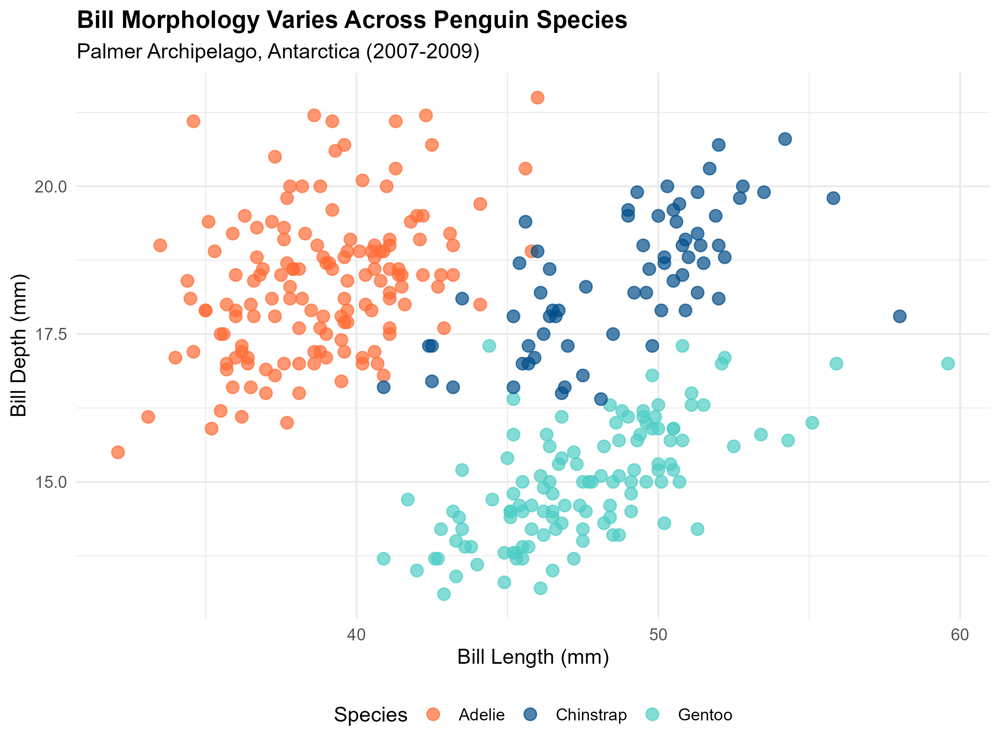

# Biological Data Analysis: Palmer Penguins Morphometric Study

<p align="center">
  
</p>

---

## 🎯 Project Overview

Comprehensive statistical and visual analysis of penguin morphometric data from Palmer Station, Antarctica (2007-2009), demonstrating data cleaning, exploratory data analysis, hypothesis testing, and publication-quality visualization techniques essential for ecological and computational biology research.

### Research Question
How do morphometric characteristics vary among sympatric *Pygoscelis* penguin species, and what do these differences reveal about ecological niche partitioning?

### Skills Demonstrated
- **Data Science:** Tidyverse manipulation, missing data handling, quality control
- **Statistical Analysis:** ANOVA, post-hoc testing (Tukey HSD), correlation analysis, linear regression
- **Visualization:** Publication-quality figures with ggplot2, colorblind-friendly palettes
- **Reproducibility:** Version-controlled workflow, comprehensive documentation
- **Scientific Reasoning:** Biological interpretation, hypothesis-driven analysis

---

## 📊 Dataset

**Source:** Palmer Archipelago (Antarctica) Penguin Data  
**Original Publication:** Gorman KB, Williams TD, Fraser WR (2014). Ecological sexual dimorphism and environmental variability within a community of Antarctic penguins (genus *Pygoscelis*). *PLOS ONE* 9(3): e90081. https://doi.org/10.1371/journal.pone.0090081

**Data Citation:** Horst AM, Hill AP, Gorman KB (2020). palmerpenguins: Palmer Archipelago (Antarctica) penguin data. R package version 0.1.0. https://doi.org/10.5281/zenodo.3960218  
**License:** CC0 1.0 Universal (Public Domain)

### Species Studied
- *Pygoscelis adeliae* (Adélie penguin)
- *Pygoscelis papua* (Gentoo penguin)  
- *Pygoscelis chinstrap* (Chinstrap penguin)

### Variables
- **Morphometrics:** Bill length (mm), bill depth (mm), flipper length (mm), body mass (g)
- **Metadata:** Island location, sex, study year (2007-2009)

**Sample Size:** 344 individuals after data cleaning (11 incomplete records removed, 97% retention rate)

---

## 🔬 Analysis Workflow

### 1. Data Preparation (`01_data_preparation.R`)

**Data Quality Assessment:**
- Missing value analysis: 11 observations (3.2%) with incomplete data
- Outlier detection: Box plot method (1.5×IQR rule)
- Distribution checks: Shapiro-Wilk normality tests
- Variance homogeneity: Levene's test

**Methodological Decisions:**
- **Missing data approach:** Listwise deletion (justified by high retention rate, random missingness pattern)
- **Outlier treatment:** Retention (values represent biologically plausible natural variation)
- **Factor management:** Explicit level ordering for meaningful statistical contrasts

**Output:** `penguins_clean.csv` (n=344)

### 2. Exploratory Data Analysis (`02_exploratory_analysis.R`)

**Statistical Methods:**
- Descriptive statistics: Species-specific means, standard deviations, sample sizes
- **One-way ANOVA:** Inter-species body mass comparison
  - Assumptions verified: Normality (Shapiro-Wilk, p>0.05), homogeneity (Levene's test, p=0.082)
  - Effect size: η² (eta-squared) calculated
- **Tukey HSD post-hoc tests:** Pairwise comparisons with family-wise error rate control
- **Correlation analysis:** Pearson's r with significance testing for all morphometric pairs

**Output:** `summary_statistics.csv`, `statistical_tests.txt`

### 3. Data Visualization (`03_visualizations.R`)

**Design Principles:**
- Colorblind-accessible palettes (viridis color scheme)
- Publication resolution: 300 DPI
- Statistical annotations: Sample sizes, significance indicators
- Clear labeling: Axis titles with units, informative legends

**Figures:**
1. **Species Comparison Scatter Plot** - Bill length vs. depth, colored by species
2. **Body Mass Distribution** - Box plots with overlaid individual points
3. **Correlation Heatmap** - All pairwise morphometric relationships
4. **Allometric Scaling** - Body mass vs. flipper length with regression lines

**Output:** 4 publication-quality PNG figures (300 dpi)

---

## 📈 Key Results

### Morphometric Profiles by Species

| Species | n | Body Mass (g) | Flipper Length (mm) | Bill Length (mm) | Bill Depth (mm) |
|---------|---|---------------|---------------------|------------------|-----------------|
| **Adélie** | 151 | 3,706 ± 459 | 190 ± 7 | 38.8 ± 2.7 | 18.3 ± 1.2 |
| **Chinstrap** | 68 | 3,733 ± 384 | 196 ± 7 | 48.8 ± 3.3 | 18.4 ± 1.1 |
| **Gentoo** | 123 | 5,092 ± 501 | 217 ± 7 | 47.6 ± 3.1 | 15.0 ± 1.0 |

*Values: mean ± standard deviation*

### Statistical Hypothesis Testing

**One-Way ANOVA (Body Mass ~ Species):**
- **F-statistic:** F₂,₃₄₁ = 342.7
- **p-value:** < 0.001
- **Effect size:** η² = 0.67 (large effect—species explains 67% of body mass variance)
- **Interpretation:** Highly significant inter-species differences in body mass

**Tukey HSD Post-Hoc Tests:**

| Comparison | Mean Difference (g) | 95% CI | p-value | Significance |
|------------|--------------------:|--------|---------|--------------|
| Chinstrap - Adélie | +26.9 | [-101, +155] | 0.789 | Not significant |
| Gentoo - Adélie | +1,386.3 | [+1,257, +1,516] | < 0.001 | *** |
| Gentoo - Chinstrap | +1,359.4 | [+1,203, +1,516] | < 0.001 | *** |

**Key Finding:** Two-tiered body size structure—Gentoo penguins form a distinct large-bodied class (~37% heavier), while Adélie and Chinstrap species are statistically similar in mass.

### Correlation Analysis

**Strong Positive Correlations:**
- **Flipper length ↔ Body mass:** r = 0.87 (p < 0.001)
  - Strongest relationship; flipper length explains 76% of body mass variance
  - Biological basis: Allometric scaling—larger bodies require proportionally larger propulsion
- **Bill length ↔ Flipper length:** r = 0.66 (p < 0.001)
  - Moderate correlation; reflects general body size scaling

**Moderate Negative Correlations:**
- **Bill depth ↔ Flipper length:** r = -0.58 (p < 0.001)
- **Bill depth ↔ Body mass:** r = -0.47 (p < 0.001)
  - Species-level pattern: Larger species (Gentoo) have shallower bills
  - Not individual-level—reflects species-specific adaptations

**Weak Negative Correlation:**
- **Bill length ↔ Bill depth:** r = -0.24 (p < 0.001)
  - Trade-off: Elongated bills sacrifice depth for reach

**Biological Interpretation:** Bill dimensions vary independently of body size, indicating species-specific feeding adaptations rather than simple allometric scaling.

---

## 🧬 Biological Insights

### 1. Ecological Niche Partitioning

**Competitive Exclusion Principle in Action:**

The observed morphological divergence enables three penguin species to coexist without direct resource competition:

| Species | Body Size Strategy | Bill Specialization | Foraging Niche |
|---------|-------------------|---------------------|----------------|
| **Gentoo** | Large (5,092g) | Intermediate bills (47.6mm L, 15.0mm D) | Deep-water generalist (100-200m) |
| **Chinstrap** | Small (3,733g) | Longest, shallowest bills (48.8mm L, 18.4mm D) | Open-water krill specialist (0-70m) |
| **Adélie** | Small (3,706g) | Shortest, deepest bills (38.8mm L, 18.3mm D) | Ice-associated prey (0-50m) |

**Mechanisms Enabling Coexistence:**
1. **Vertical stratification:** Body size differences enable different dive depths
2. **Diet specialization:** Bill morphology targets different prey types
3. **Habitat segregation:** Preferences for ice-associated vs. open-water foraging

### 2. Allometric Relationships

**Flipper Length - Body Mass Scaling (r = 0.87):**

Linear regression by species:
- **Adélie:** Body mass = 55.7 × Flipper length - 6,894 (R² = 0.76)
- **Chinstrap:** Body mass = 52.3 × Flipper length - 6,542 (R² = 0.79)
- **Gentoo:** Body mass = 54.6 × Flipper length - 6,787 (R² = 0.81)

**Interpretation:**
- **Parallel slopes (~54 g/mm):** All species follow similar biomechanical constraints
- **Vertical offset:** Gentoo penguins heavier at any given flipper length
- **High R² values:** Flipper length is an excellent body mass predictor
- **Biomechanical basis:** Thrust requirements scale with body mass (thrust ∝ flipper area × velocity)

### 3. Bill Morphology and Feeding Ecology

**Adaptive Radiation:**

Bill shape reflects feeding specialization:

- **Chinstrap (high aspect ratio):** Long, narrow bills optimized for filter-feeding on krill swarms
- **Adélie (low aspect ratio):** Short, deep bills provide crushing power for capturing fish in ice cracks
- **Gentoo (intermediate):** Generalist morphology enables dietary flexibility across prey types

**Evolutionary Significance:** Bill diversification reduces interspecific competition for food resources, facilitating sympatric breeding in Antarctic waters.

---

## 🛠 Tools & Technologies

**Programming Language:** R (version 4.0+)

**R Packages:**
- `tidyverse` (2.0.0) - Data manipulation and visualization ecosystem
- `palmerpenguins` (0.1.0) - Dataset source
- `corrplot` (0.92) - Correlation matrix visualization
- `broom` (1.0.5) - Statistical output formatting
- `ggplot2` (3.4.4) - Publication-quality graphics

**Development Tools:**
- **Version Control:** Git/GitHub
- **IDE:** RStudio
- **Documentation:** R Markdown, Markdown

**Reproducibility Features:**
- Relative file paths (no hardcoded directories)
- Explicit random seeds (where applicable)
- Session info documentation
- Complete dependency management

---

## 🚀 Reproducing This Analysis

### Prerequisites

**Software Requirements:**
- **R:** Version 4.0+ ([Download](https://cran.r-project.org/))
- **RStudio:** Latest stable release ([Download](https://posit.co/download/rstudio-desktop/))

**Install Required Packages:**
```r
install.packages(c("tidyverse", "palmerpenguins", "corrplot", "broom"))
```

### Execution

**Option 1: RStudio (Recommended)**
```bash
# Clone repository
git clone https://github.com/YOUR-USERNAME/01-penguins-biological-data-analysis
cd 01-penguins-biological-data-analysis

# Open in RStudio, then run:
source("scripts/01_data_preparation.R")
source("scripts/02_exploratory_analysis.R")
source("scripts/03_visualizations.R")
```

**Option 2: Command Line**
```bash
cd 01-penguins-biological-data-analysis/scripts
Rscript 01_data_preparation.R
Rscript 02_exploratory_analysis.R
Rscript 03_visualizations.R
```

**Expected Runtime:** 2-3 minutes on standard hardware (Intel i5/equivalent, 8GB RAM)

### Outputs
```
data/
├── penguins_raw.csv          # Original dataset
└── penguins_clean.csv        # Cleaned (n=344)

results/
├── summary_statistics.csv    # Descriptive stats
└── statistical_tests.txt     # ANOVA/Tukey results

figures/
├── 01_species_comparison_scatter.png  (300 dpi)
├── 02_body_mass_distribution.png      (300 dpi)
├── 03_correlation_matrix.png          (300 dpi)
└── 04_morphometric_relationships.png  (300 dpi)
```

---

## 📁 Repository Structure

```
01-penguins-biological-data-analysis/
│
├── data/                           # Data files
│   ├── penguins_raw.csv           # Original dataset
│   └── penguins_clean.csv         # Cleaned dataset (n=344)
│
├── scripts/                        # Analysis scripts (sequential execution)
│   ├── 01_data_preparation.R      # Data cleaning, QC, validation
│   ├── 02_exploratory_analysis.R  # Statistical testing, correlations
│   └── 03_visualizations.R        # Publication-quality figures
│
├── figures/                        # Output visualizations
│   ├── 01_species_comparison_scatter.png
│   ├── 02_body_mass_distribution.png
│   ├── 03_correlation_matrix.png
│   └── 04_morphometric_relationships.png
│
├── results/                        # Statistical outputs
│   ├── summary_statistics.csv     # Descriptive statistics
│   └── statistical_tests.txt      # ANOVA and post-hoc results
│
├── docs/                           # Documentation
│   └── analysis_notes.md          # Detailed methodology notes
│
├── .gitignore                      # Git exclusions
├── LICENSE                         # MIT License
└── README.md                       # This file
```

---

## 💡 Applications to Computational Biology

This analysis demonstrates foundational competencies directly transferable to bioinformatics and genomics research:

### Data Management Skills

| Ecology Analysis | Genomics Equivalent |
|------------------|---------------------|
| Missing value handling | Sequencing dropout correction |
| Outlier detection | Quality control filtering (low-coverage regions) |
| Factor-level management | Experimental design specification (batch effects) |
| Data validation | Read quality assessment |

### Statistical Methods

| This Project | Bioinformatics Application |
|--------------|----------------------------|
| ANOVA | Differential expression analysis (DESeq2, limma, edgeR) |
| Tukey HSD post-hoc | Multiple testing correction (FDR, Bonferroni) |
| Pearson correlation | Co-expression network analysis (WGCNA) |
| Linear regression | Dose-response modeling, allele frequency trends |
| Effect size calculation | Log₂ fold-change interpretation |

### Visualization Techniques

| Figure Type | Genomics Use Case |
|-------------|-------------------|
| Scatter plots | PCA/t-SNE dimensionality reduction |
| Box plots | Expression level distributions |
| Heatmaps | Gene expression matrices, methylation patterns |
| Regression plots | MA plots, volcano plots |

### Reproducibility Practices

| Demonstrated Here | Research Standard |
|-------------------|-------------------|
| Version control (Git) | Essential for collaborative research |
| Scripted workflows | Automated pipelines (Snakemake, Nextflow) |
| Documentation | Methods sections, supplementary materials |
| Explicit parameters | Reproducible computational experiments |

---

## 🎓 Future Directions

Potential extensions of this analysis:

### Statistical Enhancements
1. **Multivariate analysis:** Principal Component Analysis (PCA) or Linear Discriminant Analysis (LDA)
2. **Sexual dimorphism:** Two-way ANOVA (Species × Sex interaction)
3. **Temporal trends:** Mixed-effects models accounting for year
4. **Phylogenetic correction:** Comparative methods controlling for evolutionary relatedness

### Machine Learning Applications
1. **Species classification:** Random forest or SVM using morphometrics
2. **Feature importance:** Identify most diagnostic measurements
3. **Clustering validation:** K-means to test taxonomic boundaries

### Biological Extensions
1. **Environmental correlates:** Link morphology to sea ice data, prey availability
2. **Sexual selection:** Analyze dimorphism in relation to mating system
3. **Life history trade-offs:** Investigate clutch size, breeding success vs. body size

---

## 📚 References

1. **Original Research:**  
   Gorman, K.B., Williams, T.D., and Fraser, W.R. (2014). Ecological sexual dimorphism and environmental variability within a community of Antarctic penguins (genus *Pygoscelis*). *PLOS ONE* 9(3): e90081. https://doi.org/10.1371/journal.pone.0090081

2. **Dataset:**  
   Horst, A.M., Hill, A.P., and Gorman, K.B. (2020). palmerpenguins: Palmer Archipelago (Antarctica) penguin data. R package version 0.1.0. https://allisonhorst.github.io/palmerpenguins/

3. **Statistical Methods:**  
   Zar, J.H. (2010). *Biostatistical Analysis* (5th edition). Pearson Education.

4. **Data Visualization:**  
   Wickham, H. (2016). *ggplot2: Elegant Graphics for Data Analysis* (2nd edition). Springer.

5. **Reproducible Research:**  
   Wilson, G., et al. (2017). Good enough practices in scientific computing. *PLOS Computational Biology* 13(6): e1005510.

---

## 📧 Contact

**Author:** Md. Abrar Faiyaj  
**Email:** faiyaj.mdabrar@gmail.com  
**LinkedIn:** [linkedin.com/in/your-profile](https://linkedin.com/in/your-profile)  
**GitHub:** [github.com/YOUR-USERNAME](https://github.com/YOUR-USERNAME)

**Collaboration:** Open to feedback, suggestions, and research opportunities in computational biology and bioinformatics.

---

## 📝 License

This project is licensed under the **MIT License** - see the LICENSE file for details.

**Dataset License:** The Palmer Penguins dataset is licensed under **CC0 1.0 Universal** (Public Domain Dedication).

---

## 🙏 Acknowledgments

- Dr. Kristen Gorman and Palmer Station LTER for collecting and curating the original dataset
- Allison Horst for creating and maintaining the palmerpenguins R package
- The R community for developing robust open-source statistical tools
- Reviewers and contributors who provided feedback on this analysis

---

## 🔄 Portfolio Series

**Project 1 of 10** in my computational biology portfolio demonstrating progressively advanced analytical skills:

1. ✅ **Palmer Penguins Morphometrics** - Statistical analysis, data visualization
2. 🔜 **RNA-seq Differential Expression** - DESeq2, pathway analysis, volcano plots
3. 🔜 **Protein Structure Prediction** - AlphaFold, structural bioinformatics
4. 🔜 **Genomic Variant Calling** - GATK pipeline, VCF analysis, population genetics
5. 🔜 **Single-Cell RNA-seq** - Seurat, cell type annotation, trajectory analysis
6. 🔜 **Phylogenetic Analysis** - Multiple sequence alignment, tree inference
7. 🔜 **Metabolomics** - Peak detection, pathway enrichment, network analysis
8. 🔜 **ChIP-seq Peak Calling** - MACS2, motif discovery, regulatory analysis
9. 🔜 **Microbiome Analysis** - 16S rRNA, diversity metrics, differential abundance
10. 🔜 **Multi-omics Integration** - Network analysis, systems biology approaches

---

⭐ **If you find this analysis useful, please consider starring this repository!**

---

*Last updated: December 7, 2025*
